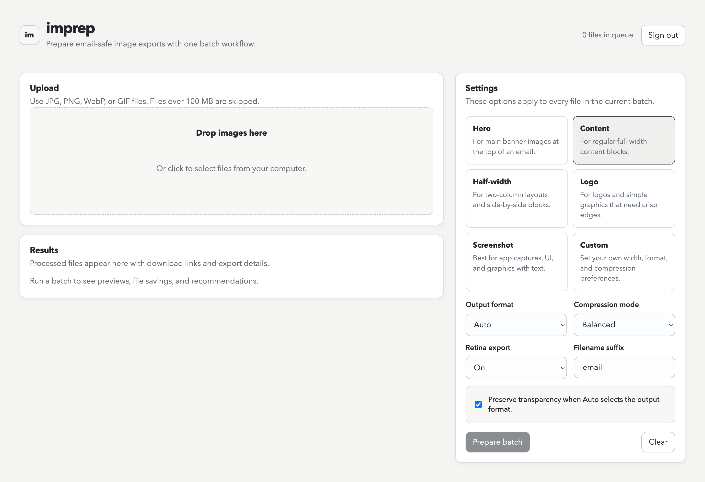

# imprep


`imprep` is a small web app for preparing images for email marketing and newsletter campaigns in one click. Upload images, apply email-friendly presets, and export cleaner assets without digging through manual resize and compression steps.

## Screenshot




## Features

- Prepare images for email campaigns with ready-to-use export presets
- Upload multiple files and process them as a batch
- Generate optimized image outputs and ZIP downloads
- Keep processing behind authenticated access
- Review export results before downloading

## Stack

- Next.js
- React
- TypeScript
- Supabase
- Sharp
- JSZip

## Commands

```bash
npm install
npm run dev
npm run build
npm start
npm test
```

## Getting Started

1. Install dependencies:

```bash
npm install
```

2. Start the development server:

```bash
npm run dev
```

3. Open the app in your browser and configure the required project environment on your side.

## License

This project is licensed under the MIT License. See the [LICENSE](./LICENSE) file for details.
